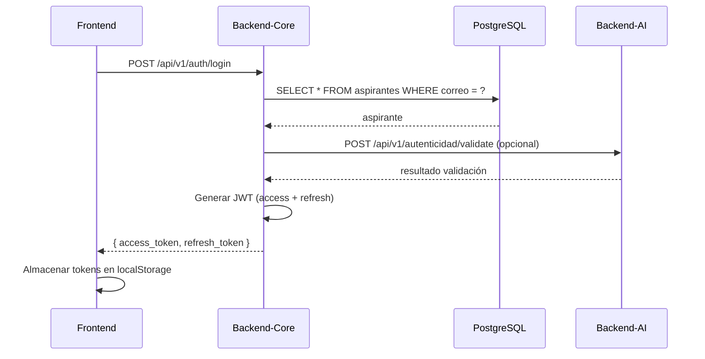
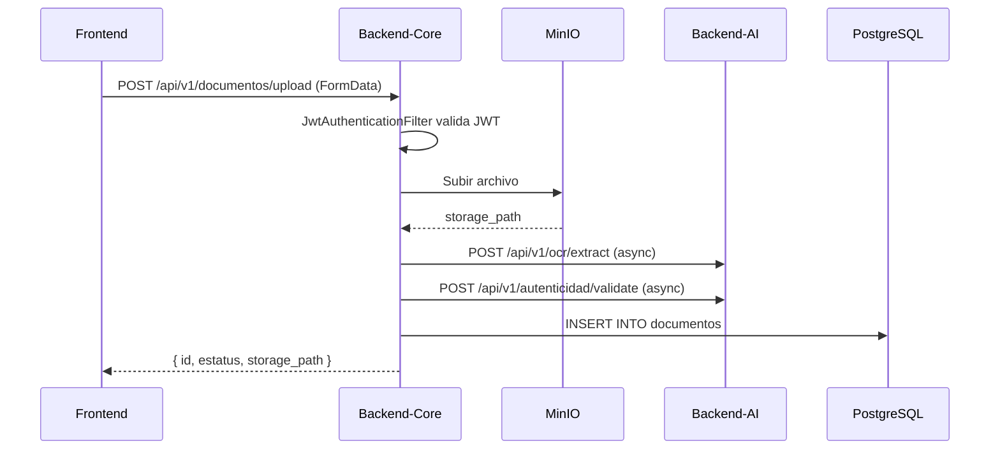

# Arquitectura del Sistema - Gestiona T

**Versión:** 1.4.0  
**Fecha:** 28 de agosto de 2026  
**Arquitectura:** Monorepo con servicios desacoplados y entorno local verificado

---

## 1. Visión general

Gestiona T es una plataforma web para digitalizar el reclutamiento y la
selección de aspirantes del Instituto Nacional Electoral. Está organizado
como un monorepo que reúne:

- Frontend web en Next.js.
- Backend core en Spring Boot.
- Backend AI en FastAPI.
- Infraestructura local con Docker Compose, PostgreSQL y MinIO.

La arquitectura separa la experiencia web, las reglas transaccionales y el
procesamiento inteligente. La configuración local está verificada sobre los
puertos definitivos del proyecto.

---

## 2. Arquitectura de servicios

### 2.1 Frontend

**Responsabilidades:**
- Interfaz para aspirantes y personal administrativo.
- Registro, autenticación, perfil, CV, documentos, postulaciones y seguimiento.
- Carta declaratoria, firma electrónica y consulta de documentos generados.
- Administración de aspirantes, vacantes, postulaciones, expedientes y contratación.
- Consumo de las APIs del Backend Core y presentación de resultados de IA.

**Rutas principales:**
- Públicas: inicio, registro y login.
- Protegidas: panel, perfil, CV, documentos, carta y seguimiento.
- Administrativas: aspirantes, vacantes, postulaciones, expedientes y contratación.

**Tecnologías:**
- Next.js 16.2.10
- React 19.2.4
- TypeScript 5
- Tailwind CSS 4

**Puerto verificado:** 3007

### 2.2 Backend Core

**Responsabilidades:**
- Lógica de negocio transaccional.
- Seguridad, autenticación JWT y control de acceso.
- Persistencia en PostgreSQL.
- Almacenamiento de documentos en MinIO.
- Integración con servicios de IA.
- Gestión de usuarios, CV, vacantes, postulaciones y expedientes.
- Carta declaratoria, firma electrónica, generación de PDF y auditoría.

**Tecnologías:**
- Java 17
- Spring Boot 3.3.2
- Spring Security
- Spring Data JPA
- PostgreSQL, MinIO, JWT, OpenAPI

**Puerto verificado:** 8087

### 2.3 Backend AI

**Responsabilidades:**
- Matching curricular.
- OCR y extracción de texto.
- Anonimización de datos sensibles.
- Validación de autenticidad documental.
- Procesamiento de lenguaje natural, embeddings y scoring.

**Tecnologías:**
- Python 3.12
- FastAPI
- Uvicorn
- spaCy, transformers, sentence-transformers

**Puerto verificado:** 8007

---

## 3. Diagrama funcional

```text
Usuario / Aspirante / Administrador
        |
        v
Frontend (Next.js 16.2.10) :3007
        |
        v
Backend Core (Spring Boot 3.3.2) :8087
        |\
        | +--> Backend AI (FastAPI) :8007
        |
        +--> PostgreSQL :5439
        +--> MinIO :9007/9008
```

---

## 4. Flujo principal

### 4.1 Autenticación
1. El aspirante inicia el registro con CURP, correo, teléfono y contraseña.
2. El frontend envía los datos a `POST /api/v1/auth/registro/iniciar`.
3. El Backend Core valida duplicados, crea la cuenta con estado
  `REGISTRO_VALIDADO` y permite continuar sin depender de OTP ni SMTP.
4. En el acceso, la API valida las credenciales, genera un JWT y el cliente
  lo reutiliza en las peticiones autenticadas.

### 4.2 Carga documental
1. El usuario sube documentos desde el frontend.
2. El backend core valida el contexto y autentica la operación.
3. El Backend Core registra metadatos y almacena los archivos en MinIO.
4. El Backend AI puede procesarlos para OCR, extracción, anonimización o
  validación de autenticidad.

### 4.3 Matching curricular
1. El backend core invoca al backend AI.
2. El backend AI recibe la solicitud en `POST /api/v1/matching/evaluar`.
3. El servicio compara perfiles, genera scores y aplica la regla de ceguera curricular.
4. El backend core persiste el score, nivel y mensaje en PostgreSQL.
5. La integración fue validada desde `http://localhost:3007/cv`, con resultado de 23.8%.

### 4.4 Vacantes y postulaciones
1. El aspirante consulta vacantes publicadas y sus requisitos.
2. Envía una postulación desde el frontend.
3. El Backend Core registra la postulación y la relaciona con el aspirante,
  la vacante y su expediente.
4. El personal administrativo consulta y da seguimiento a postulaciones,
  expedientes y contratación.

### 4.5 Carta declaratoria y firma
1. El aspirante revisa y acepta los bloques declaratorios.
2. El sistema registra la firma electrónica y genera el PDF correspondiente.
3. Los documentos firmados se almacenan en MinIO y el evento queda disponible
  para auditoría y trazabilidad.

---

## 5. Infraestructura compartida

### PostgreSQL
- Base de datos transaccional.
- Puerto host: 5439.
- Base: gestiona_t
- Usuario: gestiona_user

### MinIO
- Almacenamiento tipo S3 para documentos y CV.
- API: http://localhost:9007
- Console: http://localhost:9008
- Buckets creados: cv-documentos, documentos, cartas-declaratorias, documentos-firmados.

### Docker Compose
- Levanta PostgreSQL y MinIO de manera aislada.
- Facilita reproducibilidad del entorno local.

---

## 6. Estado actual

### Implementado y validado

- Monorepo con frontend, Backend Core y Backend AI desacoplados.
- Registro directo de aspirantes sin dependencia de SMTP.
- Login con JWT, perfiles, CV, documentos y expedientes.
- Vacantes, postulaciones, carta declaratoria y firma electrónica.
- Almacenamiento de archivos y documentos firmados en MinIO.
- Matching curricular integrado con resultado visible en la interfaz; se validó
  un resultado de referencia de 23.8% de compatibilidad baja.
- Compilación del Backend Core con Maven y build de producción del frontend
  con Next.js y TypeScript.
- Frontend configurado para desarrollo desde `10.15.0.59`, evitando el bloqueo
  del recurso HMR.

### Pendiente de consolidación

- Ejecutar una prueba end-to-end del nuevo registro contra la base activa.
- Completar pruebas automáticas de documentos, firma y postulaciones.
- Centralizar variables de entorno y preparar el despliegue objetivo.
- Fortalecer observabilidad, auditoría y controles de seguridad para producción.

---

## 7. Priorizaciones técnicas

1. Mantener la coherencia entre servicios, contratos API y documentación.
2. Validar end-to-end el registro y los flujos de documentos, firma y postulaciones.
3. Centralizar configuración y preparar el despliegue objetivo.
4. Fortalecer auditoría, seguridad y observabilidad antes de producción.

---

**Fin del documento ARQUITECTURA_SISTEMA.md**

### 5.2 MinIO

**Propósito:** Almacenamiento de objetos (documentos, PDFs)

**Buckets:**
- `cv-documentos` - CVs y documentos personales
- `documentos` - Documentos generales
- `cartas-declaratorias` - Cartas declaratorias
- `documentos-firmados` - Documentos firmados

**Conexión:**
- Endpoint: http://localhost:9007
- Access Key: minioadmin
- Secret Key: MinioAdmin_2026_Secure

---

## 6. Integraciones Externas

### 6.1 APIs Oficiales

| Servicio | URL | Propósito |
|----------|-----|-----------|
| RENAPO | https://api.renapo.gob.mx/v1 | Validación CURP |
| Lista Nominal | https://api.ine.mx/lista-nominal/v1 | Validación Clave Elector |
| RNP | https://api.rnp.sep.gob.mx/v1 | Validación RFC |
| SAT | https://api.sat.gob.mx/v1 | Validación obligaciones fiscales |
| SFP | https://api.sfp.gob.mx/v1 | Verificación inhabilitación |
| RENADEA | https://api.consejojudicial.gob.mx/renadea/v1 | Antecedentes penales |
| Violencia | https://api.segob.gob.mx/violencia/v1 | Validación violencia |

### 6.2 Backend-AI

**Comunicación:**
- Protocolo: HTTP/REST
- URL base: http://localhost:8007
- Endpoint de negocio de matching: http://localhost:8007/api/v1/matching/evaluar
- Autenticación: API Key (configurable)

**Servicios:**
- Matching curricular
- OCR y extracción
- Anonimización
- Validación autenticidad

---

## 7. Configuración

### 7.1 Variables de Entorno

**Backend-Core (application.yml):**
```yaml
spring:
  datasource:
    url: jdbc:postgresql://${DB_HOST:localhost}:${DB_PORT:5439}/${DB_NAME:gestiona_t}
    username: ${DB_USER:gestiona_user}
    password: ${DB_PASSWORD:GestionaT_2026_Secure}

jwt:
  secret: ${JWT_SECRET:gestionat_ine_2026_super_secret_key}
  expiration:
    ms: ${JWT_EXPIRATION_MS:3600000}

minio:
  endpoint: ${MINIO_ENDPOINT:http://localhost:9007}
  access:
    key: ${MINIO_ACCESS_KEY:minioadmin}
  secret:
    key: ${MINIO_SECRET_KEY:MinioAdmin_2026_Secure}

cors:
  allowed:
    origins: ${CORS_ALLOWED_ORIGINS:http://localhost:3007}
```

**Frontend (.env.local):**
```env
NEXT_PUBLIC_API_URL=http://localhost:8087/api/v1
NEXT_PUBLIC_AI_URL=http://localhost:8007/api/v1
```

**Backend-AI (.env):**
```env
MINIO_ENDPOINT=http://localhost:9007
MINIO_ACCESS_KEY=minioadmin
MINIO_SECRET_KEY=MinioAdmin_2026_Secure
```

### 7.2 Docker Compose

**Servicios:**
- PostgreSQL 16
- MinIO
- Nginx (reverse proxy)

**Comandos:**
```bash
docker-compose up -d    # Iniciar servicios
docker-compose down     # Detener servicios
docker-compose logs -ft # Ver logs
```

---

## 8. Despliegue

### 8.1 Desarrollo Local

**Requisitos:**
- Docker Desktop
- Node.js 20+
- Java 17 (JDK)
- Python 3.12
- Maven 3.9+

**Pasos:**
1. Clonar repositorio
2. Configurar variables de entorno
3. Levantar servicios con Docker Compose
4. Iniciar frontend: `npm run dev`
5. Iniciar backend-core: `mvn spring-boot:run`
6. Iniciar backend-ai: `uvicorn main:app --reload`

### 8.2 Producción

**Infraestructura:**
- Kubernetes (AKS)
- PostgreSQL Managed
- MinIO Gateway
- HashiCorp Vault (secretos)
- Azure Application Insights (monitoring)

**CI/CD:**
- GitHub Actions
- Docker Registry
- Helm Charts

---

## 9. Monitoreo y Logging

### 9.1 Logging

**Backend-Core:**
- Nivel: DEBUG para mx.ine.gestiona_t
- Formato: JSON estructurado
- Destino: Console + Archivo

**Backend-AI:**
- Nivel: INFO
- Formato: Texto estructurado
- Destino: Console + Archivo

**Frontend:**
- Console browser
- Axios interceptors para errores

### 9.2 Métricas

**Actuator Endpoints:**
- `/actuator/health` - Health check
- `/actuator/info` - Información de la aplicación
- `/actuator/metrics` - Métricas de JVM

**Application Insights:**
- Traces distribuidos
- Custom metrics
- Alerts

---

## 10. Consideraciones de Diseño

### 10.1 Clean Architecture

**Backend-Core:**
- Controller: Endpoints REST
- Service: Lógica de negocio
- Repository: Acceso a datos
- DTO: Objetos de transferencia
- Model: Entidades JPA

### 10.2 Separación de Responsabilidades

**Frontend:**
- UI separada de lógica de negocio
- Servicios para comunicación API
- Context para estado global
- Components reutilizables

**Backend-Core:**
- Módulos funcionales independientes
- Integraciones externas en capa separada
- Auditoría transversal
- Excepciones centralizadas

### 10.3 Performance

**Frontend:**
- Server-Side Rendering para SEO
- Code splitting por ruta
- Lazy loading de componentes
- Optimización de imágenes

**Backend-Core:**
- Connection pooling (HikariCP)
- Caching con Redis (opcional)
- Async processing para operaciones largas
- Rate limiting

### 10.4 Escalabilidad

**Horizontal Scaling:**
- Frontend: Kubernetes HPA
- Backend-Core: Kubernetes HPA
- Backend-AI: Kubernetes HPA

**Vertical Scaling:**
- PostgreSQL: Managed Service
- MinIO: Distributed mode

---

## 11. Diagramas de Secuencia

### 11.1 Login



### 11.2 Carga de Documentos



---

## 12. Troubleshooting

### 12.1 Problemas Comunes

**Error 403 en carga de documentos:**
- Causa: Request cache habilitado en Spring Security con multipart
- Solución: Deshabilitar request cache en SecurityConfig
- Referencia: SOLUCION_PROBLEMA_CARGA_DOCUMENTOS.md

**Error de conexión a PostgreSQL:**
- Verificar que Docker esté corriendo
- Verificar puerto 5439
- Verificar credenciales en .env

**Error de conexión a MinIO:**
- Verificar que MinIO esté corriendo
- Verificar puerto 9007
- Verificar buckets creados

### 12.2 Logs

**Backend-Core:**
- Nivel DEBUG para mx.ine.gestiona_t
- Logs de JWT filter: "🔍 [JWT FILTER]"
- Logs de documentos: "📤 POST /api/v1/documentos/upload"

**Frontend:**
- Console browser
- Axios interceptors: "❌ [API INTERCEPTOR] Error en respuesta"

---

## 13. Referencias

- [README.md](./README.md) - Visión general del proyecto
- [RESUMEN_PROYECTO.md](./RESUMEN_PROYECTO.md) - Resumen técnico
- [ESTRUCTURA_PROYECTO.md](./ESTRUCTURA_PROYECTO.md) - Estructura detallada
- [Base_de_Datos.md](./Base_de_Datos.md) - Esquema de base de datos
- [SOLUCION_PROBLEMA_CARGA_DOCUMENTOS.md](./SOLUCION_PROBLEMA_CARGA_DOCUMENTOS.md) - Solución problema carga
- [GUIA_LEVANTAR_SERVICIOS.md](./GUIA_LEVANTAR_SERVICIOS.md) - Guía de levantamiento

---

**Fin del documento ARQUITECTURA_SISTEMA.md**
