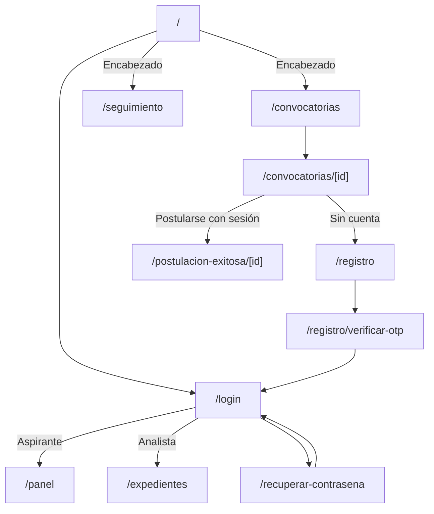
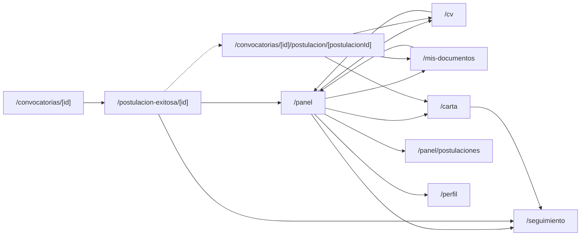
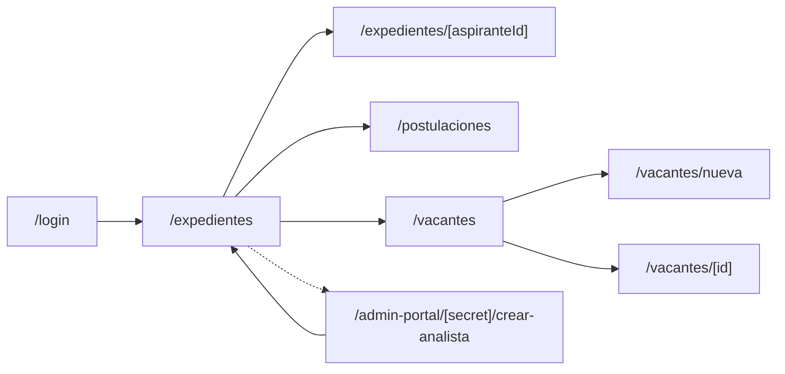

# Observaciones de navegación por tipo de usuario

## 1. Alcance y criterio

Se revisaron las rutas del frontend, las redirecciones del login, los enlaces de los dashboards y los saltos entre páginas. Los nombres de los grupos de rutas de Next.js, como `(public)`, `(protected)` y `(admin)`, no forman parte de la URL visible.

El sistema tiene dos experiencias principales:

- **Aspirante:** consulta convocatorias, se postula, completa su expediente y consulta el estado.
- **Analista:** administra vacantes, revisa expedientes y actualiza el estado de postulaciones.

La decisión de rol se realiza en `/login` mediante la opción **Ingresar como Analista del INE**. Después del acceso, el destino es:

- Aspirante: `/panel`
- Analista: `/expedientes`

## 2. Inventario de URLs observadas

### URLs públicas o de entrada

| URL | Propósito | Acceso esperado |
|---|---|---|
| `/` | Inicio institucional e información general de la plataforma | Público; la navegación a convocatorias y seguimiento se realiza desde el encabezado |
| `/convocatorias` | Lista de vacantes vigentes | Público; las acciones de postulación requieren sesión. Con sesión de aspirante muestra su menú superior |
| `/convocatorias/[id]` | Detalle de una convocatoria y acción de postularse | Público para consultar; aspirante autenticado para postularse y con menú superior |
| `/login` | Inicio de sesión y selección aspirante/analista | Público |
| `/registro` | Alta de cuenta de aspirante | Público |
| `/registro/verificar-otp` | Verificación del registro mediante OTP | Aspirante en registro |
| `/recuperar-contrasena` | Recuperación de contraseña | Público |
| `/seguimiento` | Vista de seguimiento actualmente estática | Visible públicamente; muestra el menú superior del postulante |

### URLs del aspirante

| URL | Propósito | Observación de navegación |
|---|---|---|
| `/panel` | Dashboard principal del aspirante | Destino posterior al login |
| `/mis-documentos` | Lista, consulta, descarga, carga y eliminación de documentos | Enlazada desde `/panel` |
| `/cv` | Alta o edición del CV institucional | Disponible desde el menú superior del aspirante y desde el flujo de postulación |
| `/carta` | Revisión y firma de la carta declaratoria | Disponible desde el menú superior y enlazada desde `/panel` |
| `/panel/postulaciones` | Lista de postulaciones propias | Disponible desde el menú superior y desde `/panel` |
| `/postulacion-exitosa/[id]` | Confirmación de postulación registrada y próximos pasos | Destino inmediato después de postularse; puede volver al panel o continuar el flujo |
| `/convocatorias/[id]/postulacion/[postulacionId]` | Flujo de completar CV, documentos y carta para una postulación | Existe, pero no se observa una liga desde el flujo principal |
| `/perfil` | Administración de datos de cuenta | Disponible desde el menú superior del aspirante |

En las rutas del aspirante se muestra un menú superior común con accesos a `/panel`,
`/convocatorias`, `/panel/postulaciones`, `/mis-documentos`, `/cv`, `/carta`,
`/seguimiento` y `/perfil`. En escritorio se presenta como navegación horizontal y en
móvil/tableta como menú desplegable.

### URLs del analista

| URL | Propósito | Acceso esperado |
|---|---|---|
| `/expedientes` | Dashboard principal: búsqueda y resumen de expedientes | Analista autenticado; consulta `/api/v1/admin/aspirantes` |
| `/expedientes/[aspiranteId]` | Detalle de un expediente; consulta y validación documental | Analista autenticado |
| `/postulaciones` | Lista de postulaciones recibidas y actualización de estatus | Analista autenticado; consulta el listado global de `/api/v1/postulaciones` |
| `/vacantes` | Lista y administración de vacantes | Analista autenticado |
| `/vacantes/nueva` | Alta de una vacante | Analista autenticado |
| `/vacantes/[id]` | Detalle o edición de una vacante | Analista autenticado |
| `/admin-portal/[secret]/crear-analista` | Alta y desactivación de cuentas de analista | Solo `ADMIN_SISTEMA`, con secreto en la ruta |

## 3. Orden lógico del aspirante

### Flujo principal recomendado

1. `/` o `/convocatorias` desde el encabezado
2. `/convocatorias/[id]`
3. Si no tiene cuenta: `/registro`
4. `/registro/verificar-otp`
5. `/login`
6. `/panel`
7. `/postulacion-exitosa/[id]` después de confirmar la postulación
8. `/cv`
9. `/mis-documentos`
10. `/carta`
11. `/seguimiento`
12. `/panel/postulaciones` para consultar todas sus postulaciones
13. `/perfil` como administración de cuenta

El orden operativo más claro después de postularse es:

`postulación registrada -> CV -> documentos -> carta declaratoria -> seguimiento`

El dashboard `/panel` debe funcionar como punto de retorno y mostrar el progreso de cada etapa. `/postulacion-exitosa/[id]` debe ser una confirmación breve, no un segundo dashboard.

### Variantes de acceso del aspirante

- **Aspirante nuevo:** `/` -> `/convocatorias` -> `/convocatorias/[id]` -> `/registro` -> `/registro/verificar-otp` -> `/login` -> `/panel`.
- **Aspirante registrado:** `/` o `/convocatorias` -> `/login` -> `/panel`.
- **Contraseña olvidada:** `/login` -> `/recuperar-contrasena` -> `/login` -> `/panel`.
- **Acceso directo a una convocatoria:** `/convocatorias/[id]`; puede consultar sin sesión, pero al pulsar postularse debe ir a `/login` si no hay sesión y regresar a la convocatoria después del acceso.
- **Acceso directo a una tarea:** `/cv`, `/mis-documentos`, `/carta` o `/panel/postulaciones`; si no hay sesión, debe enviarse a `/login` y luego devolverse a la URL original.
- **Convocatoria ya atendida:** `/convocatorias/[id]` debe mostrar que ya existe una postulación y llevar a `/panel/postulaciones` o al detalle de completar postulación, no permitir una segunda alta.

## 4. Orden lógico del analista

### Flujo principal recomendado

1. `/login`
2. Activar **Ingresar como Analista del INE**
3. `/expedientes`
4. `/expedientes/[aspiranteId]` para revisar y validar documentos
5. `/postulaciones` para revisar y actualizar el estatus de la postulación
6. `/vacantes` para consultar la oferta publicada
7. `/vacantes/nueva` para publicar una vacante
8. `/vacantes/[id]` para consultar o editar una vacante
9. Volver a `/expedientes` como dashboard operativo

El dashboard analista debe priorizar el trabajo de revisión: **expedientes -> detalle y validación -> postulaciones -> vacantes**. Las vacantes son la operación de publicación; los expedientes y postulaciones son la operación de seguimiento.

### Variante de administración del sistema

Solo un usuario con rol `ADMIN_SISTEMA` debe acceder a:

`/login` -> `/expedientes` -> `/admin-portal/[secret]/crear-analista`

Esta última URL debe considerarse una herramienta administrativa excepcional, no una opción del menú diario del analista. Los roles `ANALISTA_UR`, `CONTRALORIA` y `ADMIN_SISTEMA` actualmente terminan en el mismo dashboard `/expedientes`; si sus permisos o menús deben diferir, hace falta definir destinos y capacidades por rol.

## 5. Diagramas de navegación

### Entrada común y bifurcación por usuario

### Flujo del aspirante

El menú superior común permite regresar al panel o saltar entre las secciones del aspirante desde las rutas de navegación disponibles.

### Flujo del analista

## 6. Hallazgos y URLs que requieren atención

### Prioridad alta

1. **Destino de carta unificado.** El flujo de completar postulación utiliza la página implementada `/carta`; la ruta inexistente `/carta-declaratoria/[id]/firmar` ya no forma parte del flujo.
2. **Flujo de completar postulación conectado.** La confirmación de postulación enlaza con `/convocatorias/[id]/postulacion/[postulacionId]`, y el panel del aspirante expone accesos a sus tareas y postulaciones.
3. **Falta retorno después del login.** Cuando un usuario no autenticado llega directamente a una convocatoria o a una tarea, debe conservarse la URL de origen (`returnUrl`) para continuar el flujo después del login.
4. **Rutas protegidas sin una protección de navegación única.** El middleware revisa el secreto de `/admin-portal`, pero no separa de forma centralizada rutas de aspirante y analista. El acceso real depende de las llamadas a la API y de comprobaciones dispersas en páginas. Se requiere definir una política única de redirección por rol.
5. **Seguimiento no representa todavía una postulación concreta.** `/seguimiento` muestra pasos fijos y no recibe `postulacionId`. Para usuarios con varias postulaciones, se requiere `/seguimiento/[postulacionId]` o un selector claro dentro de `/seguimiento`.

### Prioridad media

6. **CV disponible en la navegación del aspirante.** `/cv` forma parte del menú superior común y también del flujo de completar postulación. Resuelto.
7. **Mis postulaciones disponible en la navegación del aspirante.** `/panel/postulaciones` forma parte del menú superior y de las acciones del panel. Resuelto.
8. **Identificador de detalle de expediente.** La ruta se estandarizó como `/expedientes/[aspiranteId]`, porque el valor utilizado por la página y las consultas es el identificador del aspirante.
9. **Redirección interna inconsistente.** En el detalle de expediente se corrigió el destino de error para usar `/expedientes`.
10. **Portal de creación de analistas sin liga visible.** La ruta especial está disponible por URL, pero no tiene entrada visible. Eso puede ser correcto por seguridad; debe existir un procedimiento administrativo documentado y una validación de permisos en backend, no solo en `localStorage`.

### Prioridad baja o decisión funcional pendiente

11. **Perfil y cierre de sesión resueltos en la navegación.** `/perfil` y el cierre de sesión están disponibles desde el menú superior del aspirante.
12. **Separación de roles de analista.** Los roles `ANALISTA_UR`, `CONTRALORIA` y `ADMIN_SISTEMA` comparten `/expedientes`. Se requiere confirmar si comparten las mismas ligas y operaciones.
13. **Documentos como URL de recurso.** Las acciones de ver y descargar documentos usan endpoints como `/documentos/[id]/view` y `/documentos/[id]/download`; no son páginas de navegación, pero deben quedar contemplados como recursos protegidos y con autorización por rol.

## 7. Dashboard principal con todas las opciones

### Dashboard aspirante: `/panel`

Debe presentar, como mínimo, estas entradas:

- Continuar postulación activa o seleccionar una postulación.
- `/cv` para completar o editar el CV.
- `/mis-documentos` para cargar, consultar y corregir archivos.
- `/carta` para firmar la carta declaratoria cuando los prerrequisitos estén listos.
- `/panel/postulaciones` para historial y estatus por vacante.
- `/seguimiento` o `/seguimiento/[postulacionId]` para progreso.
- `/convocatorias` para explorar otras vacantes.
- `/perfil` para datos de cuenta.
- Cerrar sesión hacia `/login`.

### Dashboard analista: `/expedientes`

Debe presentar, como mínimo, estas entradas:

- `/expedientes` para búsqueda y resumen general.
- `/postulaciones` para revisión y actualización de estatus.
- `/vacantes` para administrar convocatorias.
- `/vacantes/nueva` como acción dentro de vacantes.
- `/expedientes/[folio]` desde cada resultado.
- `/admin-portal/[secret]/crear-analista` únicamente para `ADMIN_SISTEMA`, preferiblemente desde una opción administrativa no visible para otros roles.
- Cerrar sesión hacia `/login`.

## 8. Conclusión

La arquitectura de navegación tiene dos raíces correctas: `/panel` para aspirantes y `/expedientes` para analistas. El orden de negocio también es claro: el aspirante debe pasar de convocatoria a postulación, completar CV/documentos/carta y consultar seguimiento; el analista debe pasar del dashboard a expedientes, postulaciones y vacantes.

La principal necesidad no es crear muchas páginas nuevas, sino cerrar las conexiones entre las páginas existentes y resolver los pendientes funcionales de seguimiento y protección por rol. La navegación principal y el destino de carta ya están alineados. Las URLs nuevas más justificadas serían:

- `/seguimiento/[postulacionId]`, si se admiten varias postulaciones por aspirante.
- Una ruta unificada para completar postulación, solo si no se decide reutilizar `/cv`, `/mis-documentos` y `/carta` desde `/panel`.
- Una ruta o mecanismo explícito de retorno posterior a `/login`.

La referencia a `/admin/expedientes` ya fue corregida. La navegación superior del aspirante ya permite conservar el contexto y saltar entre sus URLs. Para considerar completo el flujo todavía debe definirse la protección centralizada por rol y el seguimiento específico por postulación.

## 9. Ajustes aplicados

- El login conserva `returnUrl` para devolver al usuario a la ruta solicitada después de autenticarse.
- La sesión expirada conserva la ruta actual al redirigir a `/login`.
- El flujo de completar postulación dirige a la página implementada `/carta`.
- La confirmación de postulación enlaza directamente con `/convocatorias/[id]/postulacion/[postulacionId]`.
- El panel del aspirante expone CV, postulaciones, convocatorias y perfil.
- El `Header` compartido muestra un menú superior del aspirante en `/panel`, `/convocatorias`, `/seguimiento`, `/cv`, `/mis-documentos`, `/carta`, `/perfil` y sus subrutas.
- El menú superior del aspirante incluye accesos a panel, convocatorias, postulaciones propias, documentos, CV, carta declaratoria, seguimiento y perfil, con versión responsive para móvil y tableta.
- El detalle del expediente usa `/expedientes/[aspiranteId]` y vuelve a `/expedientes` cuando corresponde.
- La página raíz `/` conserva únicamente la presentación informativa; se retiraron sus tarjetas directas hacia `/convocatorias` y `/seguimiento`.
- La página `/expedientes` consulta el endpoint administrativo implementado `/api/v1/admin/aspirantes`.
- Se agregó el listado global `GET /api/v1/postulaciones` para analistas y administradores, ordenado por fecha de postulación descendente.