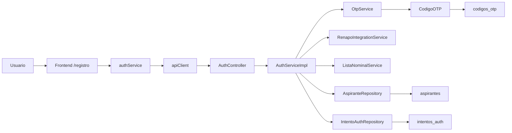

# Registro de Aspirantes - Arquitectura y flujo

## 1. Objetivo

Este módulo permite que un aspirante inicie un registro, confirme su identidad mediante un código OTP y complete la validación de su CURP o clave de elector para avanzar en el proceso del sistema.

## 2. Resumen ejecutivo

El flujo del registro está compuesto por:

1. Formulario inicial en el frontend.
2. Envío del primer registro al backend.
3. Generación y envío de un OTP por correo.
4. Verificación del OTP.
5. Validación de identidad mediante CURP o clave de elector.
6. Emisión de tokens JWT para continuar en la aplicación.

## 3. Arquitectura general

## 4. Estructura de archivos y carpetas

### Frontend

- frontend/src/app/(public)/registro/page.tsx
  - Pantalla inicial del registro.
  - Captura CURP, correo y teléfono.
  - Envía la solicitud al backend.

- frontend/src/app/(public)/registro/verificar-otp/page.tsx
  - Pantalla de verificación del código OTP.
  - Recibe el correo desde la URL y valida el código de 6 dígitos.

- frontend/src/services/auth.service.ts
  - Centraliza las llamadas a los endpoints de autenticación y registro.

- frontend/src/lib/api.ts
  - Configura axios y agrega el token JWT a las peticiones.

### Backend

- backend-core/src/main/java/mx/ine/gestiona_t/modules/auth/controller/AuthController.java
  - Expone los endpoints REST del módulo de autenticación y registro.

- backend-core/src/main/java/mx/ine/gestiona_t/modules/auth/service/AuthServiceImpl.java
  - Implementa la lógica de negocio del flujo completo.

- backend-core/src/main/java/mx/ine/gestiona_t/modules/auth/service/OtpService.java
  - Genera, almacena y valida los códigos OTP.

- backend-core/src/main/java/mx/ine/gestiona_t/modules/auth/model/Aspirante.java
  - Entidad principal del aspirante.

- backend-core/src/main/java/mx/ine/gestiona_t/modules/auth/model/CodigoOTP.java
  - Entidad para los códigos temporales de verificación.

- backend-core/src/main/java/mx/ine/gestiona_t/modules/auth/model/IntentoAuth.java
  - Registra los intentos fallidos o exitosos para auditoría y seguridad.

### Base de datos

- database/postgres/init/002_auth_tables.sql
  - Crea las tablas: aspirantes, intentos_auth y codigos_otp.

- database/postgres/init/009_seed_data.sql
  - Inserta datos base para pruebas locales.

## 5. Relaciones principales

### 5.1 Frontend → Backend

- La página de registro envía los datos a:
  - POST /api/v1/auth/registro/iniciar
- La pantalla de OTP envía:
  - POST /api/v1/auth/registro/verificar-otp
- Las validaciones de identidad usan:
  - POST /api/v1/auth/registro/validar-curp
  - POST /api/v1/auth/registro/validar-clave-elector

### 5.2 Backend → Base de datos

- AuthServiceImpl crea o actualiza registros en AspiranteRepository.
- OtpService genera un OTP y lo almacena en codigos_otp.
- IntentoAuthRepository guarda información de seguridad y auditoría.

## 6. Flujo del registro

### Paso 1: Inicio del registro

El usuario ingresa:

- CURP
- correo electrónico
- teléfono móvil

El frontend llama a authService.iniciarRegistro() y el backend:

- valida si el correo ya existe,
- crea un aspirante en estado PRE_REGISTRO,
- genera un OTP,
- lo almacena y lo envía por correo.

### Paso 2: Verificación OTP

La pantalla de verificación recibe el correo como parámetro de la URL y solicita el código de 6 dígitos.

Si el código es correcto:

- se marca el aspirante como OTP_VERIFICADO,
- se emite un token temporal para continuar con la validación de identidad.

### Paso 3: Validación de identidad

El sistema permite avanzar con una de estas dos rutas:

- CURP: se consulta a la integración con RENAPO.
- Clave de elector: se consulta a la integración de la lista nominal.

Si la validación es exitosa:

- se actualiza el nombre, CURP, RFC, método de identificación y nivel de confianza,
- se obtiene un accessToken y refreshToken.

### Paso 4: Login posterior

El login usa:

- POST /api/v1/auth/login

Y devuelve tokens JWT que el frontend guarda en localStorage para consumir el resto del sistema.

## 7. Modelos de datos clave

### Aspirante

Campos principales:

- id
- folio
- nombreCompleto
- curp
- rfc
- correoElectronico
- telefonoMovil
- passwordHash
- estatus
- metodoIdentificacion
- nivelConfianza
- fechaRegistro
- fechaUltimoAcceso
- activo

### CodigoOTP

Campos principales:

- aspiranteId
- codigoHash
- canal
- fechaExpiracion
- utilizado

### IntentoAuth

Campos principales:

- ipOrigen
- userAgent
- correoIntentado
- tipo
- resultado
- motivoFallo
- timestamp

## 8. Configuración del entorno

### Contenedores y puertos

- PostgreSQL: puerto 5439 en host, 5432 dentro del contenedor.
- Backend core: puerto 8087.
- Backend AI: puerto 8007.
- Frontend: puerto 3007.

### Variables principales

- Base de datos:
  - DB_HOST
  - DB_PORT
  - DB_NAME
  - DB_USER
  - DB_PASSWORD

- JWT:
  - JWT_SECRET
  - JWT_EXPIRATION_MS
  - JWT_REFRESH_EXPIRATION_MS

- Integraciones externas:
  - RENAPO_API_URL
  - INE_LISTA_NOMINAL_URL
  - AI_SERVICE_URL

## 9. Seguridad implementada

- Contraseñas cifradas con BCrypt.
- OTP almacenado con hash, no en texto plano.
- Tokens JWT para sesiones y refresh.
- Registro de intentos para auditoría y protección contra ataques.
- CORS configurado para permitir el frontend local.

## 10. Credenciales de prueba verificadas

En el entorno local, se verificó el siguiente usuario para pruebas de login:

- correo: prueba.completa@ine.mx
- contraseña: password

Este dato sirve para validar el flujo de autenticación posterior al registro.

## 11. Notas de operación

- El flujo está pensado para desarrollo local y pruebas de integración.
- El envío de OTP depende del servicio de correo configurado en el backend.
- En entornos de desarrollo puede haber fallos de correo, pero el OTP sigue siendo generado y persistido para validación manual.
